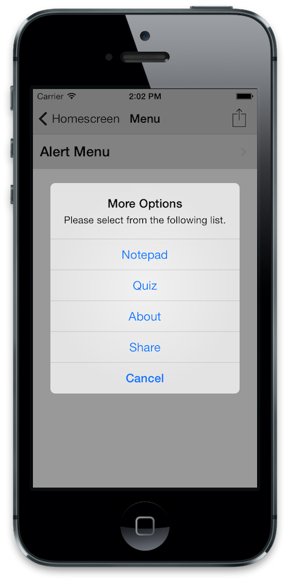
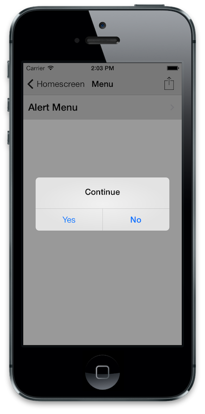
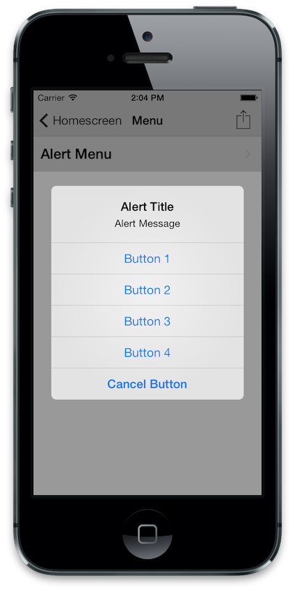
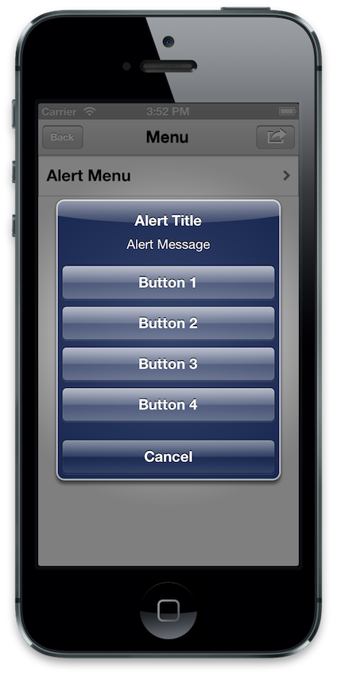

# Alert Menu Plugin for the Buzztouch Platform

## About Plugin
### Description
The Alert Menu plugin allows you to create a native UIAlertView with buttons for navigation.
For best results, set the menu item you tap to trigger the screen to "fade". 

Configure up to four buttons to show. The cancel button will always show.

### Version History
v1.0-Initial Release of Plugin

v1.1-Fixed problems with Control Panel interface:

--Fixed issues saving to database

--Fixed issue Button 4 Nickname

v1.2-Compatibility Updates

v2.0-Updated for iOS 3.0 Core

--New Control Panel Integration

--Customize the Cancel Button Title

v2.1-Compatibility Update for Buzztouch

v2.2-Fixed problem loading screens on BT3.0 Core

--Fixed a typo in the control panel

v2.3-Compatibility with BT4.0 and iOS 10

### iOS Project
JC_AlertView.h

JC_AlertView.m

### Android Project
This plugin is not compatible with Android.

### JSON Data
`{
"itemId":"12121212", 
"itemType”:”JC_AlertView", 
"itemNickname”:”AlertMenu”, 
"alertTitle”:”Alert Title”, 
"alertMessage”:”Alert Message”, 
"button1Title":"Button 1 Title", 
"button2Title":"Button 2 Title", 
"button3Title":"Button 3 Title"
}`

## Screenshots

## Installation
If a previous version of this plugin is installed on your server that was downloaded from the Buzztouch Plugin Market, we reccomend that you delete this plugin's folder under /filed/plugins/ and then upload the new package and refresh your plugin list.

## Questions and Answers
Can I use this plugin on my self-hosted Buzztouch account?

*Yes, you can download the plugin from this repository as a zip file, and upload it to your Buzztouch self-hosted Control Panel*

Can I use this plugin on apps hosted at Buzztouch.com?

*Yes, but you must install it through the [Buzztouch Plugin Market](http://www.buzztouch.com/plugins/plugin.php?pid=4A71B334AF77045EBA8E3BD).*

## Collaboration
To become a collaborator with this project, please contact us on either our [Twitter](http://twitter.com/jakechasan) or our [Facebook](http://facebook.com/jakechasanapps) pages.

## Support
For support and further questions, please contact us on either our [Twitter](http://twitter.com/jakechasan) or our [Facebook](http://facebook.com/jakechasanapps) pages.

Support is also availible from other Buzztouch users on the [Buzztouch Forums](http://www.buzztouch.com/forum/).